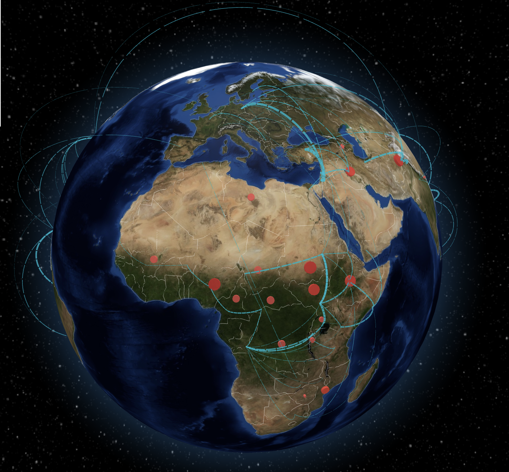
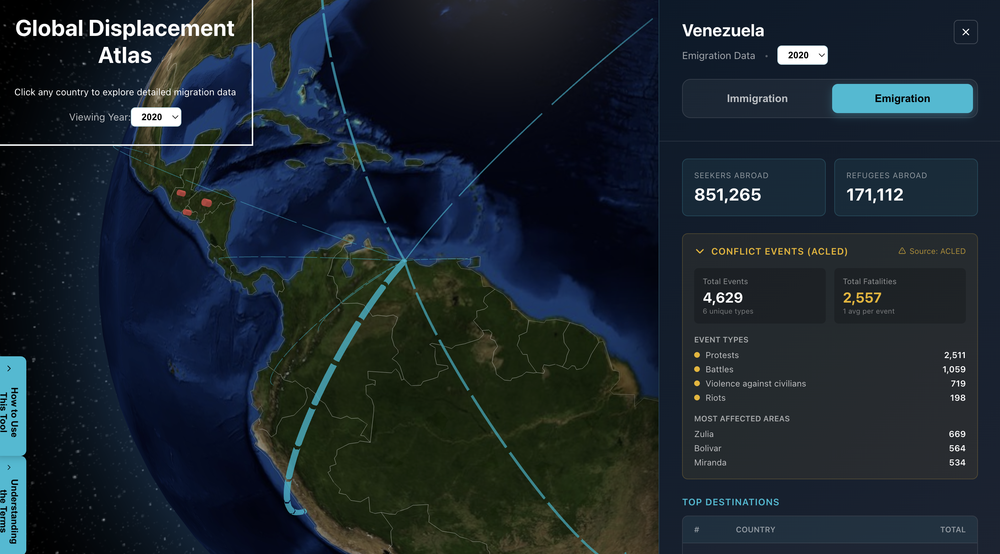

# Global Displacement Atlas

Interactive 3D globe visualizing forced displacement data worldwide—refugees, internally displaced peoples, asylum seekers, and conflict events.

# Inspiration!
This project was inspired by the New York Times' incredible article "[To Understand Global Migration, You Have to See It First](https://www.nytimes.com/interactive/2025/04/17/opinion/global-migration-facebook-data.html)" which demonstrated the power of visualizing human migration at a global scale. While that piece focused on all forms of migration using data from Meta (2022), this atlas specifically illuminates forced displacement—refugees, internally displaced peoples, and asylum seekers—using official data from the United Nations High Commissioner for Refugees (UNHCR), the International Organization for Migration (IOM), and the United Nations Relief and Works Agency (UNRWA).

The goal of this is to make the concept of migration, which we know largely anecdotally, visible on a global scale, so people can understand how migration ebbs and flows and what its current state is.  

## Data Sources

**UNHCR** — Global refugee and asylum seeker data from 1951-present  
**IOM** — Internally displaced persons (IDPs) for 53 countries, updated monthly  
**ACLED** — Conflict events, fatalities, and violence data, updated annually  
**UNRWA** — Palestine refugee data across five host countries

## Features

- **Year selection** (2000-2024) with automatic data updates
- **Country details** showing immigration/emigration flows, IDPs, and conflict events
- **3D visualization** using WebGL for smooth 60fps globe rotation
- **Automated updates** via GitHub Actions for IOM (monthly) and ACLED (annually)

## Technology

React with TypeScript, Vite, and react-globe.gl for 3D visualization. Data cached client-side for fast loading without API calls during normal use.

## Data Accuracy

Shows official registered data from UN agencies and IOM. May not include undocumented movements or seasonal patterns. Most recent year may be preliminary.

---
